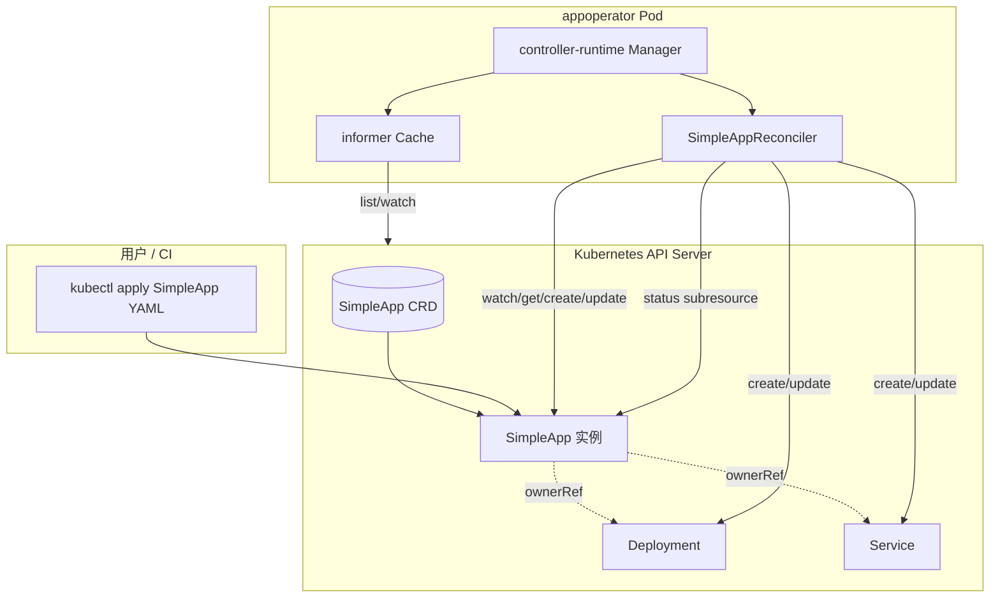
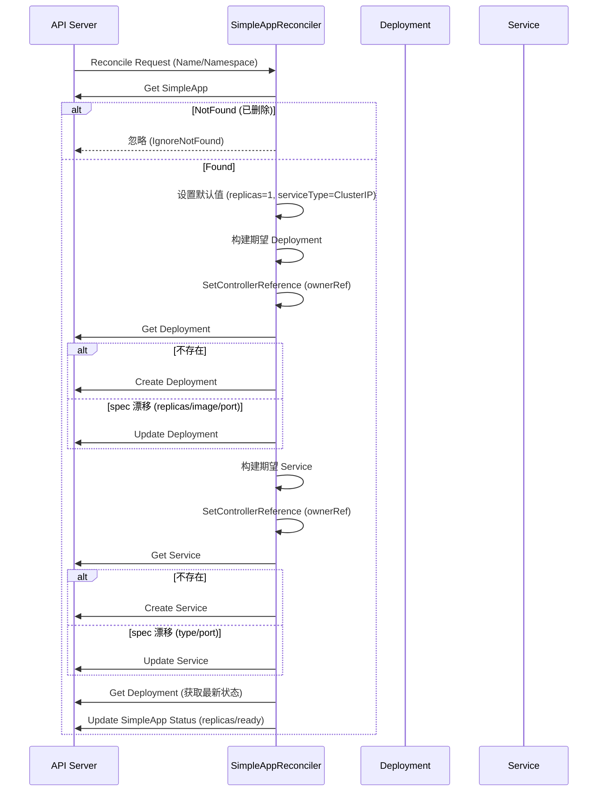
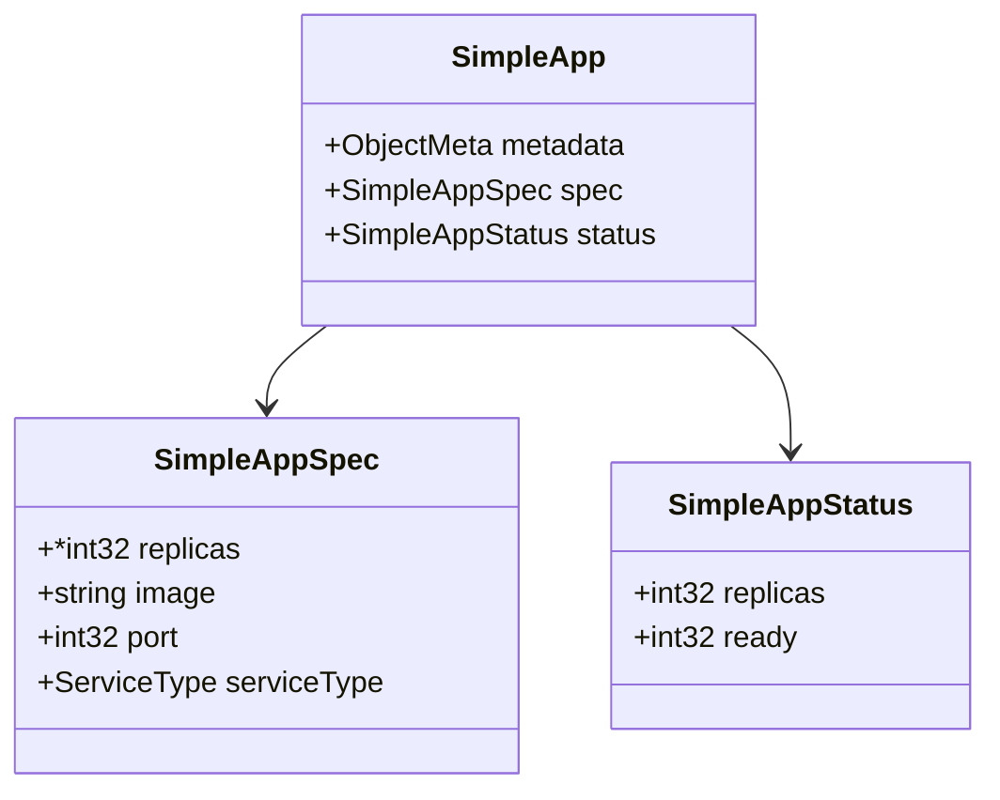
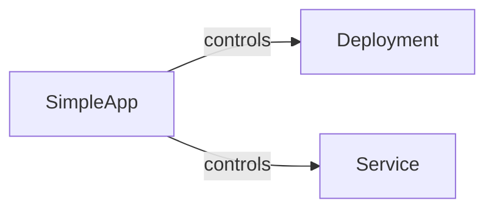
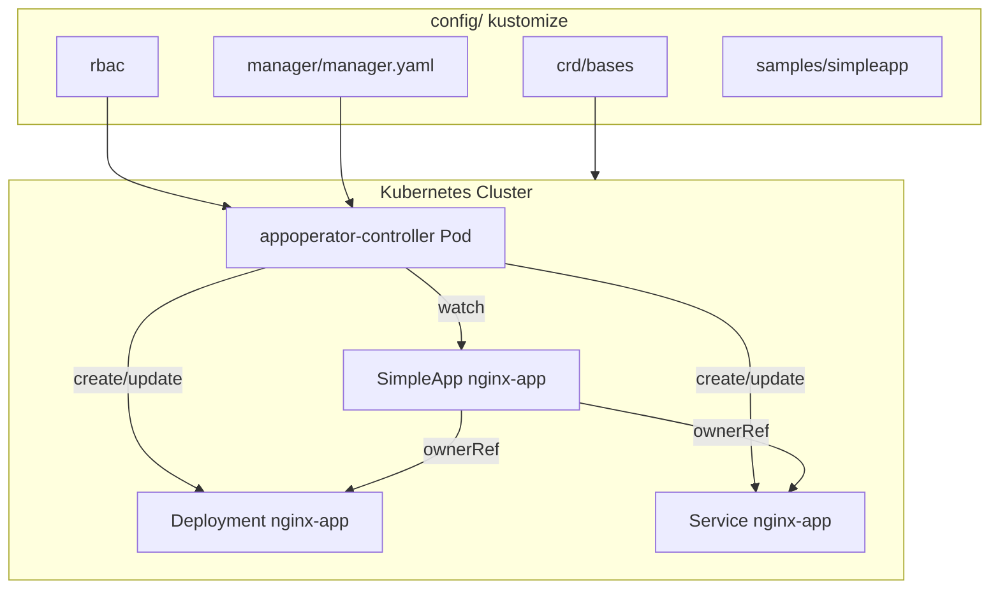

# appoperator 技术方案设计文档

## 1. 需求概述

### 1.1 背景

SES Entry Task 任务二：基于 Kubernetes Operator 模式实现应用管理自动化。用户只需声明 `SimpleApp` 自定义资源（CR），Operator 控制器自动创建并维护对应的 Deployment 和 Service，使实际状态持续趋近期望状态。

### 1.2 核心需求

- 定义 `SimpleApp` CRD（Custom Resource Definition），包含副本数、镜像、端口、Service 类型等字段。
- 实现 Operator 控制器（Reconciler），watch SimpleApp 资源并协调子资源。
- 自动管理派生资源：Deployment（工作负载）和 Service（网络暴露）。
- 通过 Owner Reference 建立资源从属关系，支持级联删除。
- 状态同步：从 Deployment 读取实际副本数和就绪副本数，回写到 SimpleApp status。
- 提供完整的 Kustomize 部署清单（CRD、RBAC、Manager、Samples）。
- 单元测试（envtest + Ginkgo）和 E2E 测试框架。

## 2. 架构设计

### 2.1 总体架构



### 2.2 核心组件

- **CRD 定义（`api/v1/simpleapp_types.go`）**
    - `SimpleAppSpec`：期望状态，包含 `replicas`（默认 1）、`image`（必填）、`port`（必填）、`serviceType`（默认 ClusterIP）。
    - `SimpleAppStatus`：实际状态，包含 `replicas`、`ready`。
    - 通过 kubebuilder marker 生成 CRD YAML、deepcopy 方法、printcolumn 等。

- **Reconciler（`internal/controller/simpleapp_controller.go`）**
    - 核心协调循环：获取 SimpleApp → 设置默认值 → 创建/更新 Deployment → 创建/更新 Service → 更新 Status。
    - 通过 `controllerutil.SetControllerReference` 建立 Owner Reference。
    - 使用 `For(SimpleApp).Owns(Deployment).Owns(Service)` 注册 watch。
    - RBAC marker 自动生成所需权限。

- **Manager（`cmd/main.go`）**
    - 组合根：Scheme 注册 → Manager 创建（含 Metrics、Health Probe、Leader Election）→ Reconciler 注册 → 启动。
    - 支持 TLS 证书热加载（certwatcher）。
    - Metrics 端点支持 HTTPS + 认证授权过滤。

- **Kustomize 配置（`config/`）**
    - `crd/`：CRD 定义与 kustomize 配置。
    - `rbac/`：ServiceAccount、ClusterRole、ClusterRoleBinding 等。
    - `manager/`：Deployment 部署清单。
    - `samples/`：示例 SimpleApp YAML。
    - `default/`：聚合入口，组合以上所有资源。

## 3. 控制循环（Reconcile）

### 3.1 Reconcile 流程



### 3.2 默认值处理

| 字段 | 默认值 | 触发条件 |
| --- | --- | --- |
| `spec.replicas` | `1` | `nil`（未设置） |
| `spec.serviceType` | `ClusterIP` | 空字符串 |

### 3.3 漂移检测

| 子资源 | 检测字段 | 修复方式 |
| --- | --- | --- |
| Deployment | `spec.replicas`、`image`、`containerPort` | 全量替换对应字段后 Update |
| Service | `spec.type`、`ports[0].port` | 全量替换对应字段后 Update |

## 4. 资源模型

### 4.1 SimpleApp Spec / Status



**kubebuilder marker 说明：**

```go
// +kubebuilder:object:root=true
// +kubebuilder:subresource:status
// +kubebuilder:printcolumn:name="Replicas",type="integer",JSONPath=".status.replicas"
// +kubebuilder:printcolumn:name="Ready",type="integer",JSONPath=".status.ready"
// +kubebuilder:printcolumn:name="Image",type="string",JSONPath=".spec.image"
```

- `subresource:status`：Status 作为独立子资源更新，与 Spec 分离。
- `printcolumn`：`kubectl get simpleapp` 时展示的额外列。

### 4.2 派生资源

| 子资源 | 名称 | Namespace | Labels | Owner Ref |
| --- | --- | --- | --- | --- |
| Deployment | 与 SimpleApp 同名 | 同 CR | `app: <name>` | 是 |
| Service | 与 SimpleApp 同名 | 同 CR | `app: <name>` | 是 |

**Deployment 详细规格：**

| 配置项 | 值 |
| --- | --- |
| Replicas | `spec.replicas` |
| Selector | `app: <name>` |
| Pod Template Labels | `app: <name>` |
| Container Name | `app` |
| Container Image | `spec.image` |
| Container Port | `spec.port` (TCP) |
| Liveness Probe | HTTP GET `/` on `spec.port`, initial 30s, period 10s |
| Readiness Probe | HTTP GET `/` on `spec.port`, initial 5s, period 5s |
| Resources | 未设置 |

**Service 详细规格：**

| 配置项 | 值 |
| --- | --- |
| Type | `spec.serviceType` |
| Selector | `app: <name>` |
| Port | `spec.port` (TCP) |

### 4.3 Owner Reference



通过 `controllerutil.SetControllerReference(app, deploy, scheme)` 建立 ownerRef。删除 SimpleApp 时，Kubernetes GC 自动清理子资源。

### 4.4 状态同步

Status 从 Deployment 读取（而非从 SimpleApp spec 回填）：

- `status.replicas` ← `deployment.spec.replicas`（期望副本数）
- `status.ready` ← `deployment.status.readyReplicas`（实际就绪副本数）

## 5. Manager 配置

### 5.1 启动参数

| 参数 | 默认值 | 说明 |
| --- | --- | --- |
| `--metrics-bind-address` | `0`（禁用） | Metrics 端点绑定地址 |
| `--health-probe-bind-address` | `:8081` | Health/Ready 探针绑定地址 |
| `--leader-elect` | `false` | 是否启用 Leader Election |
| `--metrics-secure` | `true` | Metrics 是否启用 HTTPS |
| `--enable-http2` | `false` | 是否启用 HTTP/2（默认禁用，防 CVE） |

### 5.2 Manager 组件

| 组件 | 作用 |
| --- | --- |
| Scheme | 注册 `SimpleApp` + K8s 核心类型（Deployment、Service 等） |
| Manager | 缓存、客户端、Leader Election |
| Metrics Server | Prometheus metrics（可选 HTTPS + 认证） |
| Health / Ready Probe | 健康检查端点 |
| Webhook Server | 预留，当前未启用 Admission Webhook |
| Cert Watcher | TLS 证书热加载 |

## 6. RBAC 权限模型

通过 kubebuilder marker 生成 RBAC 清单：

```go
// +kubebuilder:rbac:groups=app.example.com,resources=simpleapps,verbs=get;list;watch;create;update;patch;delete
// +kubebuilder:rbac:groups=app.example.com,resources=simpleapps/status,verbs=get;update;patch
// +kubebuilder:rbac:groups=apps,resources=deployments,verbs=get;list;watch;create;update;patch;delete
// +kubebuilder:rbac:groups=core,resources=services,verbs=get;list;watch;create;update;patch;delete
```

| API Group | Resource | Verbs | 用途 |
| --- | --- | --- | --- |
| `app.example.com` | `simpleapps` | get/list/watch/create/update/patch/delete | CR 读写 |
| `app.example.com` | `simpleapps/status` | get/update/patch | Status 子资源更新 |
| `apps` | `deployments` | 全部 | Deployment 创建/更新/删除 |
| `core` | `services` | 全部 | Service 创建/更新/删除 |

## 7. 部署拓扑



### 7.1 部署命令

```bash
# 安装 CRD
make install

# 部署 Operator
make deploy IMG=<registry>/appoperator:<tag>

# 创建示例资源
kubectl apply -f config/samples/app_v1_simpleapp.yaml
```

### 7.2 Docker 镜像

多阶段构建（`Dockerfile`）：
- **Stage 1（builder）**：`golang:1.24`，编译 `cmd/main.go` → `manager` 二进制，CGO_ENABLED=0。
- **Stage 2（runtime）**：`gcr.io/distroless/static:nonroot`，最小化运行环境，非 root 用户（65532）。

## 8. 测试策略

### 8.1 单元测试（Controller 测试）

| 层级 | 位置 | 框架 | 说明 |
| --- | --- | --- | --- |
| Controller 测试 | `internal/controller/simpleapp_controller_test.go` | envtest + Ginkgo | 启动本地 API Server，测试 Reconcile 不失败 |
| Suite 配置 | `internal/controller/suite_test.go` | envtest | 初始化 testenv、k8sClient |

测试流程：
1. `BeforeEach`：检查 SimpleApp 是否存在，不存在则创建。
2. `It`：执行 `Reconcile` 并断言无错误。
3. `AfterEach`：删除测试资源。

### 8.2 E2E 测试

| 层级 | 位置 | 说明 |
| --- | --- | --- |
| E2E 测试 | `test/e2e/e2e_test.go` | 集群级场景（需 Kind 集群） |
| 测试工具 | `test/utils/utils.go` | 辅助函数 |

E2E 流程：
1. `make setup-test-e2e`：创建 Kind 集群（如不存在）。
2. `make test-e2e`：运行 E2E 测试。
3. `make cleanup-test-e2e`：销毁 Kind 集群。

### 8.3 运行测试

```bash
# 单元测试
make test

# E2E 测试
make test-e2e

# 代码检查
make lint
```

## 9. CI/CD

### 9.1 GitHub Actions

| Workflow | 触发条件 | 说明 |
| --- | --- | --- |
| `lint.yml` | PR/Push | golangci-lint 代码检查 |
| `test.yml` | PR/Push | 单元测试 |
| `test-e2e.yml` | 手动 / PR | E2E 测试（Kind 集群） |

### 9.2 Makefile 主要目标

| 目标 | 说明 |
| --- | --- |
| `make build` | 编译 manager 二进制 |
| `make run` | 本地运行 controller |
| `make test` | 运行单元测试（含 envtest） |
| `make lint` | golangci-lint 检查 |
| `make manifests` | 生成 CRD / RBAC / Webhook 清单 |
| `make generate` | 生成 deepcopy 代码 |
| `make docker-build` | 构建 Docker 镜像 |
| `make deploy` | 部署到 K8s 集群 |
| `make install` | 安装 CRD |

## 10. 代码分层

```
appoperator/
├── api/v1/
│   ├── simpleapp_types.go          # SimpleApp CRD 类型定义
│   ├── groupversion_info.go        # API Group/Version 注册
│   └── zz_generated.deepcopy.go    # 自动生成的 deepcopy
├── cmd/
│   └── main.go                     # 入口：Manager 创建与启动
├── internal/controller/
│   ├── simpleapp_controller.go     # Reconciler 核心逻辑
│   ├── simpleapp_controller_test.go # Controller 单元测试
│   └── suite_test.go               # envtest Suite 配置
├── config/
│   ├── crd/                        # CRD 定义
│   ├── rbac/                       # RBAC 清单
│   ├── manager/                    # Manager Deployment
│   ├── samples/                    # 示例 CR
│   ├── default/                    # Kustomize 聚合
│   ├── prometheus/                 # Prometheus Monitor
│   └── network-policy/             # 网络策略
├── test/
│   ├── e2e/                        # E2E 测试
│   └── utils/                      # 测试工具
├── .github/workflows/              # CI 配置
├── Dockerfile                      # 多阶段构建
├── Makefile                        # 构建/测试/部署命令
└── go.mod / go.sum                 # Go 依赖
```

## 11. 扩展建议

| 方向 | 说明 |
| --- | --- |
| API 校验 | `image`、`port` 必填校验，通过 CRD CEL 或 Validating Webhook |
| 二级资源 | 支持 Ingress、ConfigMap、HPA 等 |
| Finalizer | 显式清理外部依赖（如 LoadBalancer 释放） |
| 探针策略 | 按镜像类型自动切换 TCP/HTTP/Exec 探针 |
| 变更冲突 | 完善 `serviceType`、`port` 变更的冲突检测与事件记录 |
| 状态扩展 | 增加 Conditions（Available、Progressing、Degraded） |
| OLM 支持 | 生成 Operator Bundle 和 Catalog，支持 OLM 安装 |
