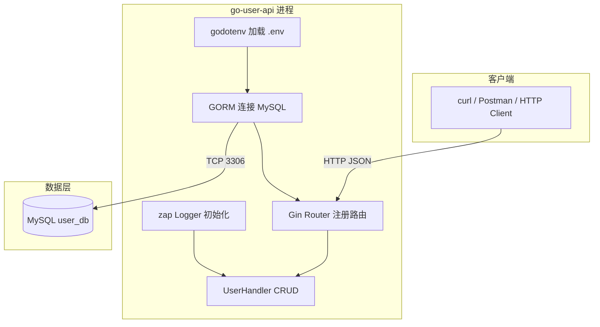
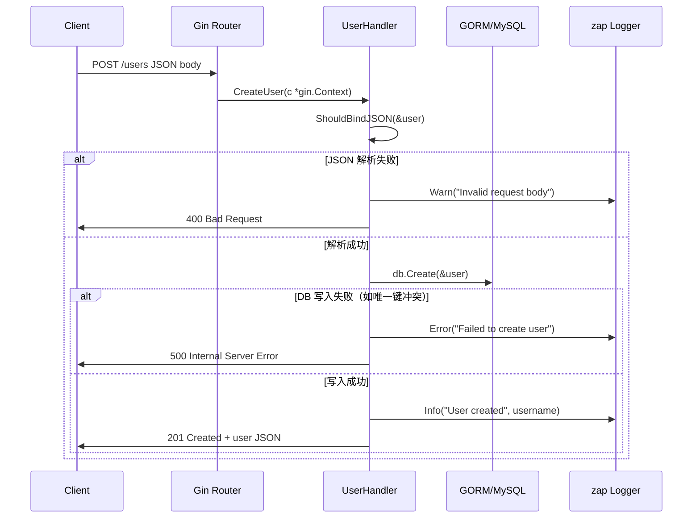
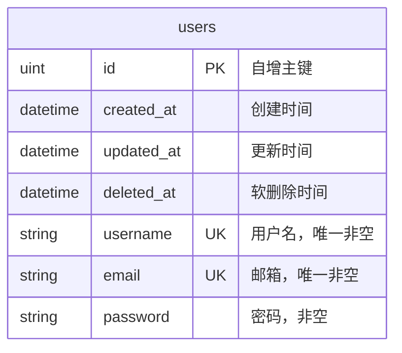
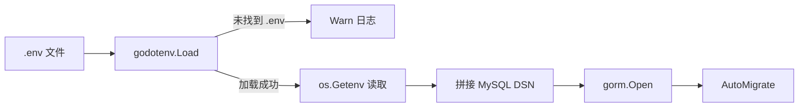

# go-user-api 技术方案设计文档

## 1. 需求概述

### 1.1 背景

SES Entry Task 任务一：基于 Go 语言实现用户管理 REST API 服务。作为新手入门项目，目标是掌握 Go Web 开发的基础技术栈：HTTP 路由、ORM 持久化、结构化日志、配置管理、单元测试。

### 1.2 核心需求

- 提供符合 REST 风格的用户 CRUD API（创建、列表、详情、更新、删除）。
- 使用 MySQL 作为持久化存储，通过环境变量配置数据库连接。
- 结构化日志（JSON 格式），包含请求上下文信息。
- 单元测试覆盖全部 API，使用内存 SQLite 替代真实 MySQL。
- 保持简单分层，便于 Entry Task 演示与答辩。

## 2. 架构设计

### 2.1 整体架构



### 2.2 核心组件

- **入口（main.go）**
    - 应用组合根（Composition Root）：按顺序初始化日志 → 加载 .env → 连接 MySQL → AutoMigrate → 注册路由 → 启动 HTTP。
    - 使用 `godotenv.Load()` 加载 `.env` 文件到环境变量，未找到时不阻塞。
    - 通过 `os.Getenv()` 拼接 MySQL DSN：`{DB_USER}:{DB_PASSWORD}@tcp({DB_HOST}:{DB_PORT})/{DB_NAME}?charset=utf8mb4&parseTime=True&loc=Local`。
    - 路由注册在 `/users` 组下，监听 `:8080` 端口。

- **UserHandler（`handler/user_handler.go`）**
    - HTTP 适配层：Gin 参数绑定（`ShouldBindJSON`、`Param("id")`）、状态码返回、调用 GORM。
    - 持有 `*gorm.DB` 引用，通过 `NewUserHandler(db)` 构造注入。
    - 每个方法独立处理一个端点：`CreateUser`、`ListUsers`、`GetUser`、`UpdateUser`、`DeleteUser`。

- **User Model（`model/user.go`）**
    - 领域实体，嵌入 `gorm.Model`（ID、CreatedAt、UpdatedAt、DeletedAt）。
    - 字段：`Username`（unique, not null）、`Email`（unique, not null）、`Password`（not null）。
    - JSON 和 GORM 标签双定义，GORM 使用软删除（`deleted_at`）。

- **Logger（`logger/logger.go`）**
    - 全局 `zap.Logger` 实例，JSON 编码输出到 stdout。
    - 配置：ISO8601 时间、小写 level、短 caller、Error 级别以上附带 stacktrace。
    - 通过 `InitLogger()` 在 main 中最先调用。

## 3. 详细设计

### 3.1 接口协议

| 方法 | 路径 | 说明 | 成功状态码 | 请求体 | 响应体 |
| --- | --- | --- | --- | --- | --- |
| POST | `/users` | 创建用户 | 201 Created | User JSON | User JSON |
| GET | `/users` | 列出所有用户 | 200 OK | - | User[] JSON |
| GET | `/users/:id` | 获取单个用户 | 200 OK | - | User JSON |
| PUT | `/users/:id` | 更新用户 | 200 OK | User JSON | User JSON |
| DELETE | `/users/:id` | 删除用户 | 204 No Content | - | - |

**User JSON 结构：**

```json
{
  "id": 1,
  "created_at": "2026-01-01T00:00:00Z",
  "updated_at": "2026-01-01T00:00:00Z",
  "deleted_at": null,
  "username": "demo",
  "email": "demo@example.com",
  "password": "secret"
}
```

**错误响应：**

```json
{
  "error": "user not found"
}
```

### 3.2 请求处理流程

以 **创建用户** 为例：



**其他接口处理差异：**

| 接口 | 差异点 |
| --- | --- |
| `ListUsers` | `db.Find(&users)` 无参数绑定，空结果返回 `[]` 而非 null |
| `GetUser` | `c.Param("id")` → `strconv.Atoi`，未找到返回 404 |
| `UpdateUser` | 先 `db.First` 查询，再 `ShouldBindJSON` 覆盖字段，最后 `db.Save` |
| `DeleteUser` | `db.Delete(&User{}, id)`，成功返回 204 无 body |

### 3.3 数据模型



`User` 结构体定义：

```go
type User struct {
    gorm.Model
    Username string `gorm:"unique;not null" json:"username"`
    Email    string `gorm:"unique;not null" json:"email"`
    Password string `gorm:"not null" json:"password"`
}
```

- `gorm.Model` 嵌入提供 ID、CreatedAt、UpdatedAt、DeletedAt。
- GORM 标签定义数据库约束（unique、not null）。
- JSON 标签定义序列化字段名。
- 软删除由 GORM 自动管理：`Delete` 操作设置 `deleted_at`，查询自动过滤已删除记录。

## 4. 配置设计

### 4.1 环境变量

| 变量 | 必填 | 说明 | 示例 |
| --- | --- | --- | --- |
| `DB_HOST` | 是 | MySQL 主机地址 | `127.0.0.1` |
| `DB_PORT` | 是 | MySQL 端口 | `3306` |
| `DB_USER` | 是 | 数据库用户名 | `root` |
| `DB_PASSWORD` | 是 | 数据库密码 | `your_password` |
| `DB_NAME` | 是 | 数据库名称 | `user_db` |

### 4.2 配置加载流程



- `.env` 文件不存在时仅输出 Warn 日志，继续使用系统环境变量。
- 服务端口固定在代码中（`:8080`），未通过环境变量控制。

## 5. 日志设计

### 5.1 日志配置

- 编码格式：JSON（结构化，便于日志系统采集）。
- 输出目标：stdout。
- 日志级别：Info 及以上。
- 附加信息：caller（文件名:行号）、stacktrace（Error 及以上）。

### 5.2 日志埋点

| 操作 | 级别 | 结构化字段 |
| --- | --- | --- |
| 创建用户成功 | Info | `username` |
| 创建用户失败 | Error | `error` |
| 请求体非法 | Warn | `error` |
| 列出用户成功 | Info | `count` |
| 用户未找到 | Warn | `id` |
| 获取用户成功 | Info | `id` |
| 更新用户成功 | Info | `id` |
| 更新用户失败 | Error | `id`, `error` |
| 删除用户成功 | Info | `id` |
| 删除用户失败 | Error | `id`, `error` |

## 6. 测试策略

### 6.1 测试架构

单元测试不依赖外部 MySQL，使用 SQLite 内存数据库：

```go
func setupTestEnv() (*gin.Engine, *gorm.DB) {
    logger.InitLogger()
    db, _ := gorm.Open(sqlite.Open(":memory:"), &gorm.Config{})
    db.AutoMigrate(&model.User{})
    gin.SetMode(gin.TestMode)
    r := gin.Default()
    userHandler := handler.NewUserHandler(db)
    userGroup := r.Group("/users")
    // ... 注册与生产相同的路由
    return r, db
}
```

- 与生产差异仅在于存储后端（SQLite vs MySQL）。
- Handler 与路由注册逻辑与生产完全一致。
- 使用 `httptest.NewRequest` + `httptest.NewRecorder` 模拟 HTTP 请求。
- 使用 `testify/assert` 做断言。

### 6.2 测试用例

| 测试函数 | 验证点 |
| --- | --- |
| `TestCreateUser` | POST `/users` 返回 201，数据正确写入 |
| `TestListUsers` | GET `/users` 返回 200，包含预插入数据 |
| `TestGetUser` | GET `/users/:id` 返回 200，获取指定用户 |
| `TestUpdateUser` | PUT `/users/:id` 返回 200，字段更新生效 |
| `TestDeleteUser` | DELETE `/users/:id` 返回 204，数据已删除 |

### 6.3 运行测试

```bash
cd entrytask/go-user-api
go test -v ./...
```

## 7. 依赖关系

```
main.go → handler, model, logger, gin, gorm, godotenv
handler → model, logger, gin, gorm
model → gorm
logger → zap
```

`handler` 不依赖 `main`，通过构造函数 `NewUserHandler(db *gorm.DB)` 注入依赖，便于测试。

## 8. 代码分层

```
go-user-api/
├── main.go              # 入口：配置加载、DB 连接、路由注册、服务启动
├── main_test.go         # API 集成测试（内存 SQLite）
├── handler/
│   └── user_handler.go  # HTTP 适配层：参数绑定、状态码、调用 GORM
├── model/
│   └── user.go          # User 实体与 GORM/JSON 标签
├── logger/
│   └── logger.go        # zap 全局实例初始化
├── go.mod / go.sum      # Go 模块依赖
├── .env                 # 环境变量（不提交 Git）
├── README.md            # 使用说明
└── ARCHITECTURE.md      # 架构文档
```

## 9. 技术栈

| 组件 | 选型 | 用途 |
| --- | --- | --- |
| Web 框架 | Gin v1.12 | HTTP 路由、参数绑定、中间件 |
| ORM | GORM v1.31 + MySQL Driver | 数据库 CRUD、AutoMigrate |
| 日志 | zap v1.27 | 结构化 JSON 日志 |
| 配置 | godotenv v1.5 | .env 文件加载 |
| 测试 | Gin httptest + SQLite 内存库 + testify | HTTP 集成测试 |

## 10. 已知限制与改进方向

| 方向 | 说明 |
| --- | --- |
| 安全 | 密码明文存储与返回，生产应 bcrypt 哈希并在 JSON 中隐藏 `password`（`json:"-"`） |
| 配置 | `SERVER_PORT` 未从环境变量读取，硬编码 `:8080` |
| API 版本 | 路由建议加 `/api/v1/users` 前缀 |
| 更新逻辑 | `UpdateUser` 先查后绑，可能误覆盖主键，建议用 DTO + `Updates` |
| 仓储层 | Handler 直接依赖 `*gorm.DB`，建议引入 `repository` 接口解耦 |
| 输入校验 | 增加 `binding:"required,email"` 等 Gin validator 标签 |
| 分页 | `ListUsers` 建议支持 `limit` / `offset` 参数 |
