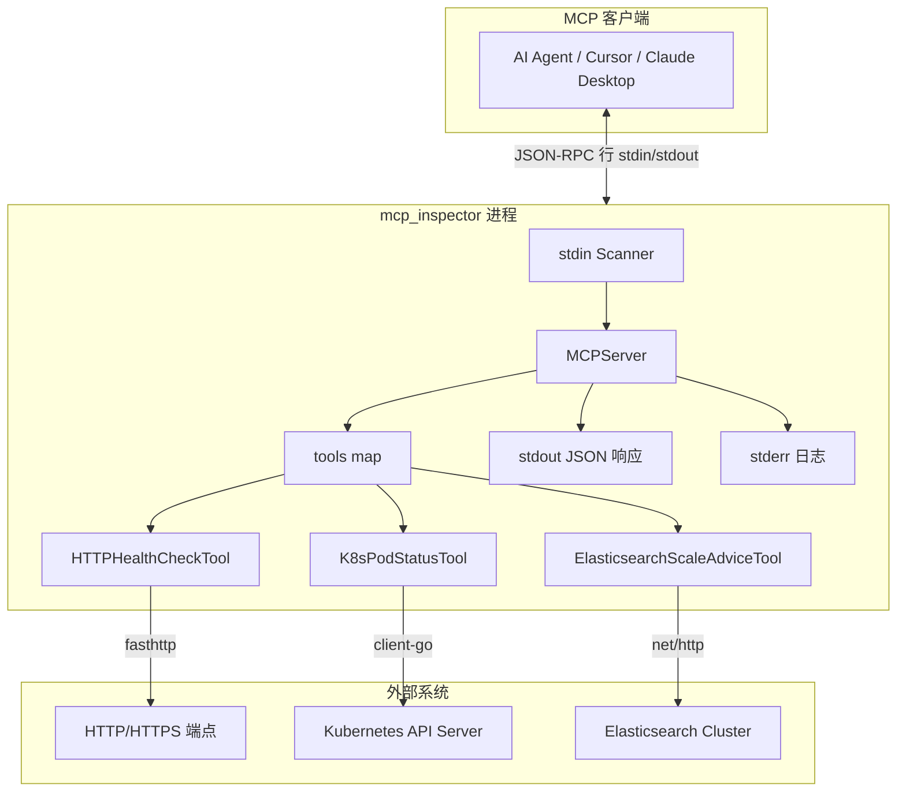
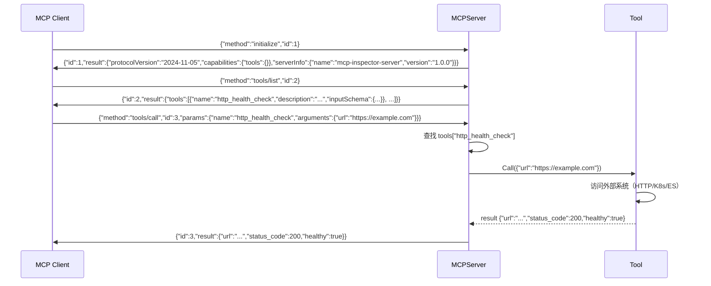
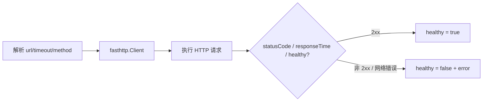
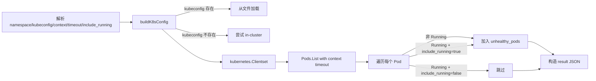
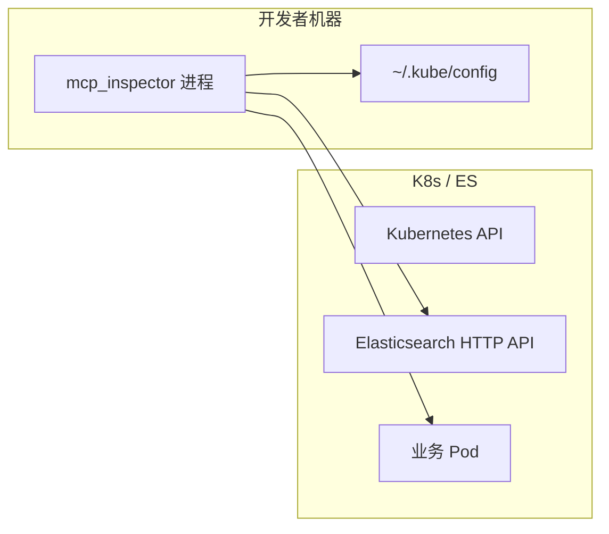

# mcp_inspector 技术方案设计文档

## 1. 需求概述

### 1.1 背景

SES Entry Task 任务三：实现一个符合 MCP（Model Context Protocol）理念的 stdio JSON-RPC 巡检服务，供 AI Agent（如 Cursor、Claude Desktop）动态发现与调用工具。将三大巡检能力（HTTP 健康检查、K8s Pod 状态、ES 集群扩容建议）封装为独立 Tool，通过标准化协议暴露。

### 1.2 核心需求

- 实现 MCP stdio JSON-RPC 2.0 协议：每行一个 JSON，诊断日志写 stderr。
- 支持 `initialize`、`tools/list`、`tools/call` 方法。
- 实现三个巡检工具：
    - `http_health_check`：HTTP/HTTPS 健康检查，返回状态码、响应时间、健康判定。
    - `kubernetes_pod_status`：K8s Pod 状态巡检，筛选异常 Pod 并返回详情。
    - `elasticsearch_scale_advice`：ES 集群扩容建议，包含健康概览、分片/节点建议、操作步骤、预期效果。
- 工具输入输出具备 JSON Schema 描述，便于客户端展示参数表单。
- 插件化架构：新增工具只需实现 `Tool` 接口并注册。

## 2. 架构设计

### 2.1 总体架构



### 2.2 核心组件

- **MCPServer（`server/mcp_server.go`）**
    - 协议中枢：读取 stdin（`bufio.Scanner`）、解析 JSON-RPC Request、方法分发、输出 stdout 响应。
    - 维护 `tools map[string]Tool` 注册表。
    - 支持四种方法：`initialize`（握手）、`tools/list`（列出所有工具及 Schema）、`tools/call`（调用指定工具）、`initialized`（通知，可忽略）。

- **Tool 接口（`server/tools.go`）**
    - 定义统一的工具契约：`Name()`、`Description()`、`InputSchema()`、`OutputSchema()`、`Call(params)`。
    - 所有巡检工具实现此接口。

- **JSON-RPC 模型（`server/jsonrpc.go`）**
    - `Request`：`jsonrpc`、`id`、`method`、`params`。
    - `Response`：`jsonrpc`、`id`、`result`。
    - `ErrorResponse`：`jsonrpc`、`id`、`error {code, message}`。

- **Tool Schemas（`schemas/tool_schemas.go`）**
    - 集中定义所有工具的 Input/Output JSON Schema。
    - 提供 `ToolInputSchemas` 和 `ToolOutputSchemas` 映射表。

- **三个工具实现（`tools/*.go`）**
    - 每个工具独立文件，内联 Schema（HTTP Health、K8s Pod Status）或引用 `schemas/` 包（ES Scale Advice）。

## 3. 插件模型

### 3.1 Tool 接口

```mermaid
classDiagram
  class Tool {
    <<interface>>
    +Name() string
    +Description() string
    +InputSchema() json.RawMessage
    +OutputSchema() json.RawMessage
    +Call(params map[string]interface{}) (interface{}, error)
  }
  class MCPServer {
    -tools map[string]Tool
    +RegisterTool(tool Tool)
    +Run()
  }
  class HTTPHealthCheckTool {
    +Call(params) (result, error)
  }
  class K8sPodStatusTool {
    +Call(params) (result, error)
  }
  class ElasticsearchScaleAdviceTool {
    +Call(params) (result, error)
  }

  Tool <|.. HTTPHealthCheckTool
  Tool <|.. K8sPodStatusTool
  Tool <|.. ElasticsearchScaleAdviceTool
  MCPServer o--> Tool : registers
```

### 3.2 新增工具步骤

1. 在 `tools/` 创建文件，实现 `server.Tool` 接口。
2. 在 `main.go` 的 `main()` 中调用 `mcpServer.RegisterTool(NewXxxTool())`。
3. （可选）在 `schemas/tool_schemas.go` 中补充 Schema 定义。

## 4. JSON-RPC 通信协议

### 4.1 传输规范

- **传输层**：stdio（stdin/stdout）。
- **消息格式**：每行一条完整的 JSON（newline-delimited JSON）。
- **日志输出**：诊断/错误日志写 stderr，禁止写入 stdout。

### 4.2 协议流程



### 4.3 错误码定义

| 错误码 | 含义 | 触发场景 |
| --- | --- | --- |
| `-999` | JSON 解析失败 | 输入不是合法 JSON |
| `-998` | 未知方法 | method 不是 `initialize`/`tools/list`/`tools/call` |
| `-1` | 缺少参数 | `tools/call` 未提供 `name` |
| `-2` | 工具不存在 | 请求的 tool name 未注册 |
| `-3` | 工具执行失败 | `Tool.Call()` 返回 error |

### 4.4 错误处理策略

| 层级 | 行为 |
| --- | --- |
| JSON 解析失败 | 返回 JSON-RPC error（code -999），服务继续监听 |
| HTTP/K8s/ES 网络错误 | 工具内捕获，在 result 对象中设置 `error` 字段，RPC 层返回 success |
| 参数校验失败 | HTTP Health 和 K8s 返回 error（RPC error code -3），ES 返回带 `error` 字段的 result |

## 5. 工具详细设计

### 5.1 HTTP 健康检查（`http_health_check`）



**输入参数：**

| 参数 | 类型 | 必填 | 默认值 | 说明 |
| --- | --- | --- | --- | --- |
| `url` | string | 是 | - | 要检查的 HTTP/HTTPS URL |
| `timeout` | integer | 否 | 5 | 超时秒数（1-30） |
| `method` | string | 否 | GET | HTTP 方法（GET/POST/HEAD） |

**输出字段：**

| 字段 | 类型 | 说明 |
| --- | --- | --- |
| `url` | string | 检查的目标 URL |
| `status_code` | integer | HTTP 响应状态码（0 表示请求失败） |
| `response_time_ms` | number | 响应时间（毫秒） |
| `healthy` | boolean | 2xx 状态码为 true |
| `error` | string | 错误信息（请求失败时非空） |

**技术实现**：使用 `valyala/fasthttp` 高性能 HTTP 客户端。请求/响应对象通过 `AcquireRequest`/`ReleaseRequest` 池化管理，避免 GC 压力。

### 5.2 K8s Pod 状态巡检（`kubernetes_pod_status`）



**输入参数：**

| 参数 | 类型 | 必填 | 默认值 | 说明 |
| --- | --- | --- | --- | --- |
| `namespace` | string | 否 | default | K8s 命名空间 |
| `kubeconfig_path` | string | 否 | ~/.kube/config | Kubeconfig 文件路径 |
| `context` | string | 否 | 当前上下文 | K8s 上下文名称 |
| `timeout` | integer | 否 | 10 | 请求超时秒数（1-60） |
| `include_running` | boolean | 否 | false | 是否包含 Running Pod |

**输出字段：**

| 字段 | 类型 | 说明 |
| --- | --- | --- |
| `namespace` | string | 巡检的命名空间 |
| `total_pods` | integer | Pod 总数 |
| `unhealthy_pods` | array | 异常 Pod 列表 |
| `unhealthy_pods[].name` | string | Pod 名称 |
| `unhealthy_pods[].status` | string | Pod 状态（Pending/CrashLoopBackOff 等） |
| `unhealthy_pods[].reason` | string | 状态原因 |
| `unhealthy_pods[].restart_count` | integer | 总重启次数 |
| `unhealthy_pods[].node_name` | string | 运行节点名称 |
| `unhealthy_pods[].creation_time` | string | 创建时间（RFC3339） |
| `error` | string | 错误信息（如有） |

**状态判定优先级**：Pod Phase → 容器 Waiting Reason → 容器 Terminated Reason → "Unknown"。

**K8s 客户端配置策略**：
1. 如果 `kubeconfig_path` 传入且文件存在 → 从文件加载。
2. 如果 kubeconfig 文件不存在 → 尝试 in-cluster config（Pod 内运行）。
3. 支持指定 context 切换集群。

### 5.3 ES 集群扩容建议（`elasticsearch_scale_advice`）

```mermaid
flowchart TB
  Params[解析 es_hosts/认证/阈值/timeout]
  Host[取 es_hosts[0] 作为主节点]
  Host --> H[GET _cluster/health]
  Host --> N[GET _nodes/stats]
  Host --> Sh[GET _cat/shards?format=json]
  H --> Merge[生成 5 段文本建议]
  N --> Merge
  Sh --> Merge
  Merge --> Out[EsScaleResult]
```

**输入参数：**

| 参数 | 类型 | 必填 | 默认值 | 说明 |
| --- | --- | --- | --- | --- |
| `es_hosts` | string[] | 是 | - | ES 集群地址列表，至少 1 个 |
| `username` | string | 否 | - | ES 认证用户名 |
| `password` | string | 否 | - | ES 认证密码 |
| `cpu_threshold` | integer | 否 | 80 | CPU 告警阈值 %（50-95） |
| `memory_threshold` | integer | 否 | 85 | 内存告警阈值 %（50-95） |
| `disk_threshold` | integer | 否 | 80 | 磁盘告警阈值 %（50-95） |
| `timeout` | integer | 否 | 10 | 超时秒数（1-60） |

**输出 5 大模块：**

| 模块 | 类型 | 内容说明 |
| --- | --- | --- |
| `cluster_health_overview` | string | 集群名称、节点数、总分片数、健康状态（green/yellow/red） |
| `shard_scale_advice` | string | 总分片数、未分配分片数、分片大小建议（30-50GB） |
| `node_scale_advice` | string | 每节点 CPU/内存/磁盘使用率与阈值对比，超标告警 |
| `operational_steps` | string | 5 步运维操作：分配解释、重试分片、重平衡、新增节点、调整分片 |
| `estimated_optimization_effect` | string | 5 项预期效果：green、延迟降 20-50%、负载安全、吞吐提升、降低风险 |

**技术实现**：使用标准库 `net/http`。Skip TLS 验证（`InsecureSkipVerify: true`）。支持 Basic Auth。仅使用 `es_hosts[0]` 作为查询入口（从集群中任一节点可获取全集群信息）。

## 6. Schema 管理

### 6.1 Schema 定义策略

| 工具 | Schema 位置 | 策略 |
| --- | --- | --- |
| `http_health_check` | `tools/http_health.go` 内联 | 工具内直接定义 `json.RawMessage` |
| `kubernetes_pod_status` | `tools/k8s_pod_status.go` 内联 | 工具内直接定义 `json.RawMessage` |
| `elasticsearch_scale_advice` | 引用 `schemas/tool_schemas.go` | 集中管理，通过包引用 |

### 6.2 Schema 映射

`schemas/tool_schemas.go` 提供两个全局映射表：

```go
var ToolInputSchemas = map[string]json.RawMessage{
    "http_health_check":          HTTPHealthCheckInputSchema,
    "kubernetes_pod_status":      K8sPodStatusInputSchema,
    "elasticsearch_scale_advice": ElasticsearchScaleAdviceInputSchema,
}

var ToolOutputSchemas = map[string]json.RawMessage{
    "http_health_check":          HTTPHealthCheckOutputSchema,
    "kubernetes_pod_status":      K8sPodStatusOutputSchema,
    "elasticsearch_scale_advice": ElasticsearchScaleAdviceOutputSchema,
}
```

## 7. 配置与部署

### 7.1 MCP 客户端配置

**Claude Desktop 配置示例（`claude_desktop_config.json`）：**

```json
{
  "mcpServers": {
    "mcp_inspector": {
      "command": "/path/to/mcp_inspector",
      "args": []
    }
  }
}
```

### 7.2 本地运行

```bash
cd entrytask/mcp_inspector
go build -o mcp_inspector .
./mcp_inspector
```

### 7.3 部署依赖



- K8s 工具依赖有效的 kubeconfig 文件或 in-cluster ServiceAccount。
- ES 工具依赖可网络访问的 ES HTTP API。
- HTTP 健康检查工具仅依赖目标 URL 可达。

## 8. 错误处理

### 8.1 分层错误处理

| 层级 | 策略 | 示例 |
| --- | --- | --- |
| JSON-RPC 协议层 | 返回 JSON-RPC error response | JSON 解析失败 → code -999 |
| 工具参数校验层 | HTTP/K8s 工具返回 error（RPC error），ES 工具返回带 error 字段的 result | url 为空 → RPC error |
| 外部系统调用层 | 所有工具捕获异常，在 result 对象中设置 `error` 字段，RPC 仍返回 success | K8s API 不可达 → result.error |

### 8.2 设计理由

- 工具业务失败（如网络不可达）不阻断 RPC 通信，客户端总能收到结构化结果。
- 参数校验失败（如必填字段缺失）返回 RPC error，提醒客户端修正参数。
- stderr 日志记录工具注册、启动等运维信息，不干扰 stdout 数据流。

## 9. 代码分层

```
mcp_inspector/
├── main.go                     # 入口：构造 MCPServer，注册 3 个 Tool，调用 Run()
├── server/
│   ├── mcp_server.go           # 协议中枢：stdin 读取、JSON-RPC 解析、方法分发、stdout 输出
│   ├── jsonrpc.go              # 协议模型：Request / Response / ErrorResponse
│   └── tools.go                # Tool 接口定义
├── tools/
│   ├── http_health.go          # HTTP 健康检查工具（fasthttp）
│   ├── k8s_pod_status.go       # K8s Pod 状态巡检工具（client-go）
│   └── elasticsearch_scale_advice.go  # ES 扩容建议工具（net/http）
├── schemas/
│   └── tool_schemas.go         # 集中 Schema 定义与映射表
├── es-k8s-deploy.yaml          # ES on K8s 部署参考 YAML
├── go.mod / go.sum             # Go 依赖
└── ARCHITECTURE.md             # 架构文档
```

## 10. 技术栈

| 组件 | 选型 | 版本 | 用途 |
| --- | --- | --- | --- |
| 语言 | Go | 1.26 | 主语言 |
| HTTP 客户端 | valyala/fasthttp | v1.52 | HTTP 健康检查（高性能） |
| K8s 客户端 | client-go | v0.27 | K8s Pod 查询 |
| ES 客户端 | net/http（标准库） | - | ES REST API 调用 |
| MCP 协议 | 自实现 | 2024-11-05 | stdio JSON-RPC |

## 11. 与 Entry Task 要求对应

| PDF 要求 | 实现 |
| --- | --- |
| stdio + JSON-RPC 2.0 | `MCPServer.Run` — 逐行读 stdin，写 stdout |
| `http_health_check` | `tools/http_health.go` — fasthttp 实现 |
| `kubernetes_pod_status` | `tools/k8s_pod_status.go` — client-go 实现 |
| `elasticsearch_scale_advice` | `tools/elasticsearch_scale_advice.go` — net/http 实现 |
| 工具 Schema | 各 Tool `InputSchema()` / `OutputSchema()` + `schemas/` |
| 可扩展结构 | `Tool` 接口 + `RegisterTool` |

**与 PDF 的差异说明：**

| 差异项 | PDF | 实现 | 原因 |
| --- | --- | --- | --- |
| ES 入参 | `es_endpoint`（单地址） | `es_hosts`（数组） | 更灵活，支持多节点 |
| `analysis_depth` | basic/detailed 分级 | 通过阈值参数调节敏感度 | 简化实现，功能等效 |

## 12. 扩展与改进建议

| 方向 | 说明 |
| --- | --- |
| Result 包装 | `tools/call` result 增加 MCP 标准 `content: [{type:"text", text: ...}]` 包装 |
| Schema 统一 | 统一 `schemas/` 与 Tool 内联 Schema，所有工具引用 `schemas/` 包避免漂移 |
| ES 增强 | 支持 `es_endpoint` 别名、`analysis_depth`（basic/detailed）分级 |
| K8s 增强 | 修正 `unhealthy_pods` 语义（仅非 Running），增加 Events 和 Logs 巡检 |
| 单元测试 | Mock HTTP/K8s/ES 客户端，覆盖参数校验、错误处理路径 |
| Resources/Prompts | 支持 MCP 的 `resources/list` 和 `prompts/list` 能力 |
| 健康检查增强 | 支持自定义 Header、Body、期望状态码、正则匹配响应体 |
